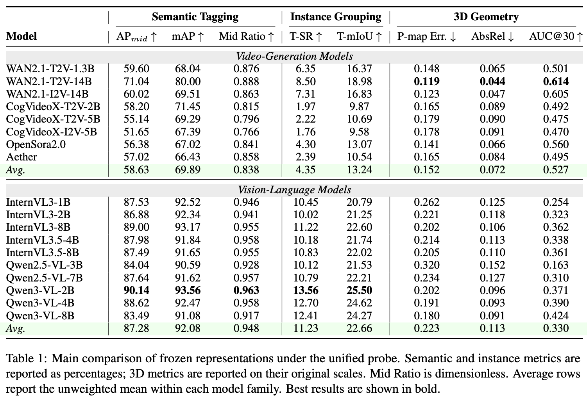

# Probing-VLM-VGM

[](https://arxiv.org/abs/2605.28132)

Official code for **"Which Pretraining Paradigm Better Serves Spatial Intelligence? An Empirical Comparison of Vision-Language and Video Generation Models."**

This repository provides a unified frozen-feature probing framework for comparing **Vision-Language Models (VLMs)** and **Video Generation Models (VGMs)** across three representative axes of spatial intelligence:

- 🏷️ **Semantic tagging**: which object categories are visible in a video clip?
- 🧩 **Instance grouping**: which pixels across views belong to the same object instance?
- 🌐 **3D geometry prediction**: how well do frozen features support point maps, depth, and camera motion?

Our experiments show a clear complementarity: **VLMs are stronger at semantic and object-centric understanding**, while **VGMs provide more accessible dense geometry and camera-motion signals**. A simple feature-level fusion of VLM and VGM representations already improves both sides, suggesting a promising direction for stronger spatial-intelligence backbones.



## 📦 Repository Structure

```text
probing_vlm_vgm/        # Probe models, datasets, losses, metrics, and training entry point
configs/                # Hydra configs for semantic tagging, instance grouping, and 3D geometry
features/               # Frozen feature extraction wrappers for VLMs and VGMs
data/                   # User-provided datasets and extracted features (ignored by git)
ckpt/                   # User-provided model checkpoints (ignored by git)
```

## 🛠️ Installation

```bash
conda create -n probing-vlm-vgm python=3.11 -y
conda activate probing-vlm-vgm

# Install PyTorch. Please adjust the CUDA version to your system.
pip install torch==2.6.0 torchvision==0.21.0 torchaudio==2.6.0

# Install PyTorch3D. This can take a while.
pip install "git+https://github.com/facebookresearch/pytorch3d.git@stable" --no-build-isolation

# Install dependencies and this package.
pip install -r requirements.txt
pip install -e .
```

By default, all llm-based feature extraction uses the PyTorch `sdpa` attention
backend for compatibility. If your machine has a compatible FlashAttention 2
build, you can optionally install it and pass
`--attn-implementation flash_attention_2`:

```bash
pip install flash-attn --no-build-isolation
```

The training code uses Hydra configs and expects `PROJECT_ROOT` to point to this repository:

```bash
export PROJECT_ROOT=/path/to/Probing-VLM-VGM
python -m probing_vlm_vgm.train --help
```


## 📚 Data Preparation

### ScanNet

ScanNet is distributed under its own Terms of Use and requires users to request access from the [official ScanNet Repository](https://github.com/ScanNet/ScanNet). Please visit it and download the dataset.

We provide a separate ScanNet preprocessing guide:
[docs/scannet_process.md](docs/scannet_process.md). It explains how to export
`.sens` files, organize official train/val splits, build 81-frame clips,
generate semantic-tagging labels, and prepare CLIP class-name embeddings.

After preprocessing, the expected layout is:

```text
data/ScanNet/
  ScanNet-processed/
    train.json
    val.json
    class_names_20.json
    train/
      scene0000_00/
        frames/frame_00000.jpg ... frame_00080.jpg
        instance_masks.npy
        poses.npy
        intrinsic.txt
        metadata.sft
        tag_pixel_counts_20.npy
  FEAT/
```

ScanNet is used for:

- 🏷️ Semantic tagging
- 🧩 Instance grouping

### DL3DV

DL3DV is used for 3D geometry probing. Download the `1K`--`6K` subsets of
[DL3DV-ALL-960P](https://huggingface.co/datasets/DL3DV/DL3DV-ALL-960P) and place
the raw videos/frames under `data/DL3DV/DL3DV-ALL-960P/`. We then use VGGT to
construct the 3D task ground truth, including point maps, depth maps, camera
poses, and confidence maps.


To build the VGGT-generated 3D ground truth, run:

```bash
python -m probing_vlm_vgm.data.processing.process_dl3dv_multigpu \
  --root data/DL3DV \
  --subset all \
  --gpus 0,1,2,3,4,5,6,7 \
  --model-path facebook/VGGT-1B \
  --num-frames 150
```

This reads scenes from `data/DL3DV/DL3DV-ALL-960P/` and writes processed targets
to `data/DL3DV/DL3DV-processed/`. After processing, create the training and
validation split:

```bash
python -m probing_vlm_vgm.data.processing.dl3dv.create_split \
  --root data/DL3DV/DL3DV-processed \
  --subset all \
  --val-ratio 0.1 \
  --seed 0 \
  --out-dir data/DL3DV/DL3DV-processed
```

The geometry supervision follows the paper setup: VGGT-generated point maps, depth maps, camera poses, and confidence maps are used as probe targets.

## ❄️ Frozen Feature Extraction

The probe is trained on frozen intermediate features. We provide feature extraction wrappers under `features/`.

Supported model families include:

- 🎥 **VGMs**: 
  - [Wan2.1-T2V-1.3B](https://huggingface.co/Wan-AI/Wan2.1-T2V-1.3B-Diffusers)
  - [WAN2.1-T2V-14B](https://huggingface.co/Wan-AI/Wan2.1-T2V-14B-Diffusers)
  - [WAN2.1-I2V-14B](https://huggingface.co/Wan-AI/Wan2.1-I2V-14B-480P-Diffusers)
  - [CogVideoX-T2V-2B](https://huggingface.co/zai-org/CogVideoX-2b)
  - [CogVideoX-T2V-5B](https://huggingface.co/zai-org/CogVideoX-5b)
  - [CogVideoX-I2V-5B](https://huggingface.co/zai-org/CogVideoX-5b-I2V)
  - [OpenSora2.0](https://huggingface.co/hpcai-tech/Open-Sora-v2)
  - Aether
  
- 🖼️ **VLMs**:
  - [InternVL3-1B](https://huggingface.co/OpenGVLab/InternVL3-1B)
  - [InternVL3-2B](https://huggingface.co/OpenGVLab/InternVL3-2B)
  - [InternVL3-8B](https://huggingface.co/OpenGVLab/InternVL3-8B)
  - [InternVL3.5-4B](https://huggingface.co/OpenGVLab/InternVL3_5-4B)
  - [InternVL3.5-8B](https://huggingface.co/OpenGVLab/InternVL3_5-8B)
  - [Qwen2.5-VL-3B](https://huggingface.co/Qwen/Qwen2.5-VL-3B-Instruct)
  - [Qwen2.5-VL-7B](https://huggingface.co/Qwen/Qwen2.5-VL-7B-Instruct)
  - [Qwen3-VL-2B](https://huggingface.co/Qwen/Qwen3-VL-2B-Instruct)
  - [Qwen3-VL-4B](https://huggingface.co/Qwen/Qwen3-VL-4B-Instruct)
  - [Qwen3-VL-8B](https://huggingface.co/Qwen/Qwen3-VL-8B-Instruct)

### DL3DV Examples

```bash
# DL3DV VGM features: WAN2.1-T2V-14B, layer 20, timestep 749.
python -m features.run_dl3dv \
  --vfm wan \
  --vfm-name wan-t2v-14b \
  --subset all \
  --dl3dv-root data/DL3DV/DL3DV-ALL-960P \
  --out-root data/DL3DV/FEAT \
  --model-id ckpt/Wan2.1-T2V-14B-Diffusers \
  --prompt "" \
  --output-layers 20 \
  --t 749

# DL3DV VLM features: Qwen3-VL-8B, layer 22.
python -m features.run_dl3dv \
  --vfm qwen3vl \
  --vfm-name qwen3-vl-8b \
  --subset all \
  --dl3dv-root data/DL3DV/DL3DV-ALL-960P \
  --out-root data/DL3DV/FEAT \
  --model-path ckpt/Qwen3-VL-8B-Instruct \
  --model-type qwen3vl \
  --use-query-frame-indices \
  --context-len 76 \
  --query-idx-divisor 4 \
  --output-layers 22
```

### ScanNet Examples

The following commands extract the ScanNet features used by the semantic
tagging and instance grouping probes. Features are written to
`data/ScanNet/FEAT/<model-name>/<split>/<scene_id>/`.

```bash
# ScanNet VGM features: WAN2.1-T2V-14B, layer 18, timestep 749.
python -m features.run_scannet \
  --vfm wan \
  --vfm-name wan-t2v-14b \
  --split both \
  --scannet-root data/ScanNet/ScanNet-processed \
  --out-root data/ScanNet/FEAT \
  --model-id ckpt/Wan2.1-T2V-14B-Diffusers \
  --prompt "" \
  --output-layers 18 \
  --t 749

# ScanNet VLM features: Qwen3-VL-8B, layer 22.
python -m features.run_scannet \
  --vfm qwen3vl \
  --vfm-name qwen3-vl-8b \
  --split both \
  --scannet-root data/ScanNet/ScanNet-processed \
  --out-root data/ScanNet/FEAT \
  --model-path ckpt/Qwen3-VL-8B-Instruct \
  --model-type qwen3vl \
  --use-query-frame-indices \
  --context-len 76 \
  --query-idx-divisor 4 \
  --output-layers 22
```

Different feature extractors may require different checkpoint paths, input resolutions, or layer/timestep choices. See the docstring at the top of each `features/*/extract_features.py` file for model-specific examples.


## 🚀 Training and Evaluation

All tasks use the same entry point:

```bash
python -m probing_vlm_vgm.train experiment=<task>/<model> job_name=<run_name>
```

### Semantic Tagging

```bash
python -m probing_vlm_vgm.train \
  experiment=scannet_tagging/qwen3-vl-8b \
  job_name=qwen3-vl-8b
```

### Instance Grouping

```bash
python -m probing_vlm_vgm.train \
  experiment=scannet/wan-t2v-14b \
  job_name=wan-t2v-14b
```

### 3D Geometry

```bash
python -m probing_vlm_vgm.train \
  experiment=dl3dv/wan-t2v-14b \
  job_name=wan-t2v-14b
```

Hydra overrides can be used to change paths, feature layers, batch sizes, or probe settings:

```bash
python -m probing_vlm_vgm.train \
  experiment=dl3dv/qwen3-vl-8b \
  job_name=qwen3-vl-8b_layer22 \
  data.feat_root=/path/to/DL3DV/FEAT \
  feat_postfix=_layer22
```

## 🔗 Feature Fusion

We include configs for simple VLM+VGM feature-level fusion:

```bash
python -m probing_vlm_vgm.train \
  experiment=dl3dv/wan-t2v-14b-qwen3-vl-8b-lnconcat \
  job_name=wan-t2v-14b_qwen3-vl-8b_fusion
```

The fusion baseline normalizes frozen features from each model and concatenates them along the channel dimension before feeding them to the same probe.


## 🧾 Citation

If you find this project useful, please cite:

```bibtex
@misc{shen2026probingvlmvgm,
      title={Which Pretraining Paradigm Better Serves Spatial Intelligence? An Empirical Comparison of Vision-Language and Video Generation Models}, 
      author={Haozhan Shen and Tiancheng Zhao and Kangjia Zhao and Jianwei Yin},
      year={2026},
      eprint={2605.28132},
      archivePrefix={arXiv},
      primaryClass={cs.CV},
      url={https://arxiv.org/abs/2605.28132}, 
}
```

## 🙏 Acknowledgments

This codebase builds on and adapts components from several excellent open-source projects, including **VidFM3D**, **VGGT**, **DUSt3R/Fast3R**, and feature extraction code or model interfaces from the evaluated VLM/VGM families. We thank the authors for making their implementations available.

Please refer to the original repositories and model cards for the licenses and terms of use of each dataset, model, and external dependency.
